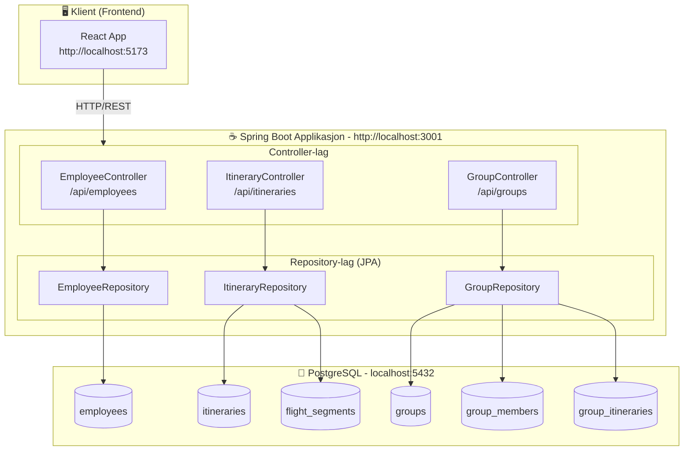
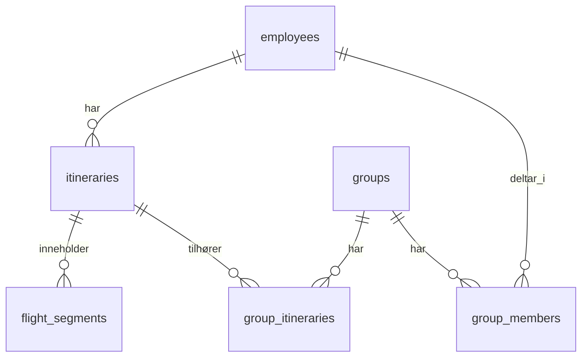

# Flight Planner Backend (Java)

En Spring Boot backend-mal for Flight Planner-applikasjonen.

## Arkitektur




### Entity-relasjoner



## Oppgaver

Oppgavene er sortert i økende vanskelighetsgrad.

### 🟢 Nivå 1: Enkel

| # | Oppgave | Fil | Beskrivelse |
|---|---------|-----|-------------|
| 1 | Hent alle ansatte | `EmployeeController.java` | Implementer `GET /api/employees` - returner liste over alle ansatte |
| 2 | Hent én ansatt | `EmployeeController.java` | Implementer `GET /api/employees/{id}` - returner en ansatt basert på ID |
| 3 | Slett ansatt | `EmployeeController.java` | Implementer `DELETE /api/employees/{id}` - slett en ansatt |
| 4 | Egendefinerte spørringer | `EmployeeRepository.java` | Legg til egendefinerte query-metoder etter behov |

### 🟡 Nivå 2: Middels

| # | Oppgave | Fil | Beskrivelse |
|---|---------|-----|-------------|
| 5 | Opprett ansatt | `EmployeeController.java` | Implementer `POST /api/employees` - opprett ny ansatt med validering |
| 6 | Oppdater ansatt | `EmployeeController.java` | Implementer `PATCH /api/employees/{id}` - oppdater eksisterende ansatt |
| 7 | Hent avatar | `EmployeeController.java` | Implementer `GET /api/employees/{id}/avatar` - hent profilbilde eller generer identicon |
| 8 | Gruppe-endepunkter | `GroupController.java` | Implementer CRUD for grupper: GET, POST, PATCH, DELETE på `/api/groups` |
| 9 | Egendefinerte spørringer | `GroupRepository.java` | Legg til egendefinerte query-metoder etter behov |

### 🟠 Nivå 3: Avansert

| # | Oppgave | Fil | Beskrivelse |
|---|---------|-----|-------------|
| 10 | Reiseplan-endepunkter | `ItineraryController.java` | Implementer CRUD for reiseplaner med filtrering på `employeeId` og `status` |
| 11 | Egendefinerte spørringer | `ItineraryRepository.java` | Legg til egendefinerte query-metoder etter behov |
| 12 | Last opp avatar | `EmployeeController.java` | Implementer `POST /api/employees/{id}/avatar` - last opp profilbilde (PNG, JPEG, WebP, maks 2MB) |
| 13 | Avatar-tabell | `001_schema.sql` | Opprett tabell for lagring av avatar med foreign key til employee |
| 14 | Avatar-entitet | `Avatar.java` | Implementer Avatar JPA-entitet |

### 🔴 Nivå 4: Ekspert

| # | Oppgave | Fil | Beskrivelse |
|---|---------|-----|-------------|
| 15 | IATA flyplasskoder | `001_schema.sql` | Implementer tabell/løsning for IATA flyplasskoder (OSL, LHR, SFO, etc.) med mulighet for valg av flyplasser |

---

## Forutsetninger

- Java 21+
- Maven 3.8+
- Docker og Docker Compose (for PostgreSQL)

## Hurtigstart

Du kan kjøre applikasjonen med enten **PostgreSQL** (standard) eller **H2 in-memory database**.

---

### Alternativ A: Kjør med PostgreSQL (standard)

#### 1. Start databasen

```bash
docker-compose up -d
```

Dette starter en PostgreSQL 16-container med:
- Database: `flightplanner`
- Bruker: `flightplanner`
- Passord: `localdev123`
- Port: `5432`

Database-skjema og testdata blir automatisk kjørt fra `db/init/`.

#### 2. Kjør applikasjonen

```bash
mvn spring-boot:run -DskipTests
```

Eller bygg og kjør:

```bash
mvn clean package
java -jar target/backend-1.0.0-SNAPSHOT.jar
```

---

### Alternativ B: Kjør med H2 In-Memory Database (ingen Docker nødvendig)

Nyttig for rask utvikling eller når du ikke har Docker tilgjengelig.

```bash
./mvnw spring-boot:run -Dspring-boot.run.profiles=h2
```

Eller bygg og kjør:

```bash
./mvnw clean package
java -jar target/backend-1.0.0-SNAPSHOT.jar --spring.profiles.active=h2
```

**H2-konsoll:** Når du kjører med H2, kan du nå database-konsollen på `http://localhost:3001/h2-console`
- JDBC URL: `jdbc:h2:mem:flightplanner`
- Bruker: `sa`
- Passord: (tom)

---

Serveren kjører på `http://localhost:3001` som standard.

## Tilgjengelige kommandoer

| Kommando | Beskrivelse |
|----------|-------------|
| `mvn spring-boot:run` | Kjør i utviklingsmodus |
| `mvn clean package` | Bygg JAR-fil |
| `mvn test` | Kjør tester |
| `mvn clean package -DskipTests` | Bygg uten tester |
| `docker-compose up -d` | Start PostgreSQL |
| `docker-compose down` | Stopp PostgreSQL |
| `docker-compose down -v` | Stopp og slett data |

## Prosjektstruktur

```
Backend/
├── db/
│   └── init/                          # SQL-filer som kjøres ved oppstart
│       ├── 001_schema.sql             # Database-skjema
│       └── 002_seed.sql               # Testdata
├── src/
│   ├── main/
│   │   ├── java/com/flightplanner/
│   │   │   ├── config/                # Konfigurasjon
│   │   │   ├── controller/            # REST-kontrollere
│   │   │   ├── dto/                   # Data Transfer Objects
│   │   │   ├── entity/                # JPA-entiteter
│   │   │   ├── exception/             # Feilhåndtering
│   │   │   ├── repository/            # JPA-repositories
│   │   │   └── Application.java       # Hovedklasse
│   │   └── resources/
│   │       └── application.yml        # Konfigurasjon
│   └── test/
│       └── java/com/flightplanner/    # Testklasser
├── docker-compose.yml                 # PostgreSQL-container
├── pom.xml                            # Maven-konfigurasjon
└── README.md
```

## Database-skjema

### Tabeller

- **employees** - Ansattdata
- **itineraries** - Reiseplaner knyttet til ansatte
- **flight_segments** - Individuelle flysegmenter i reiseplaner
- **groups** - Reisegrupper
- **group_members** - Koblintstabell for gruppemedlemskap
- **group_itineraries** - Koblingstabell for gruppereiseplaner

## API-endepunkter

### Ansatte
- `GET /api/employees` - List alle ansatte
- `GET /api/employees/{id}` - Hent ansatt med ID
- `POST /api/employees` - Opprett ansatt
- `PATCH /api/employees/{id}` - Oppdater ansatt
- `DELETE /api/employees/{id}` - Slett ansatt

### Reiseplaner
- `GET /api/itineraries` - List reiseplaner (støtter `?employeeId=` og `?status=` filtre)
- `GET /api/itineraries/{id}` - Hent reiseplan med ID
- `POST /api/itineraries` - Opprett reiseplan med segmenter
- `PATCH /api/itineraries/{id}` - Oppdater reiseplan
- `DELETE /api/itineraries/{id}` - Slett reiseplan

### Grupper
- `GET /api/groups` - List alle grupper
- `GET /api/groups/{id}` - Hent gruppe med ID
- `POST /api/groups` - Opprett gruppe
- `PATCH /api/groups/{id}` - Oppdater gruppe
- `DELETE /api/groups/{id}` - Slett gruppe

## Konfigurasjon

Miljøvariabler (eller application.yml):

| Variabel | Beskrivelse | Standard |
|----------|-------------|----------|
| `SERVER_PORT` | Serverport | `3001` |
| `POSTGRES_HOST` | Databasevert | `localhost` |
| `POSTGRES_PORT` | Databaseport | `5432` |
| `POSTGRES_DB` | Databasenavn | `flightplanner` |
| `POSTGRES_USER` | Databasebruker | `flightplanner` |
| `POSTGRES_PASSWORD` | Databasepassord | `localdev123` |
| `CORS_ORIGINS` | Tillatte CORS-opprinnelser | `http://localhost:5173` |
| `API_KEY` | API-autentiseringsnøkkel | `dev-key` |

## Hva er inkludert

- ✅ JPA-entiteter (`Employee`, `Itinerary`, `FlightSegment`, `Group`)
- ✅ JPA Repositories med grunnleggende spørringer
- ✅ Feilhåndtering med konsistent responsformat
- ✅ CORS-konfigurasjon
- ✅ Helsesjekk-endepunkt (`/health`)
- ✅ Database-skjema og testdata

## Tips

1. **Bruk de medfølgende repositories** - De har allerede nyttige spørringsmetoder
2. **Feilresponser** - Bruk `ErrorResponse.of()` hjelpere for konsistent format
3. **Validering** - Legg til `@Valid` og Jakarta valideringsannotasjoner på DTOer
4. **Entity-mapping** - Vurder MapStruct eller manuell mapping for DTO-konvertering
5. **JSON-format** - Frontend forventer camelCase egenskapsnavn (allerede konfigurert)
