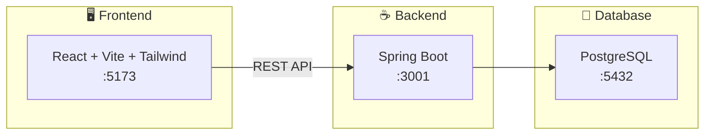

# Flight Planner

Et reiseplanleggingssystem for bedrifter. Applikasjonen lar deg administrere ansatte, reiseplaner og reisegrupper.

## Oversikt



## Domene

| Ressurs | Beskrivelse |
|---------|-------------|
| **Employees** | Ansatte som kan reise |
| **Itineraries** | Reiseplaner med flysegmenter |
| **Groups** | Grupper av ansatte for felles reiser |

## Teknologi

| Lag | Teknologi |
|-----|-----------|
| Frontend | React 19, Vite, Tailwind CSS, TypeScript |
| Backend | Spring Boot 3.2, Spring Data JPA, PostgreSQL |
| Dokumentasjon | SpringDoc OpenAPI (Swagger UI) |

## Hurtigstart

### 1. Start database

```bash
cd Backend && docker-compose up -d
```

### 2. Start backend

```bash
cd Backend && ./mvnw spring-boot:run
```

### 3. Start frontend

```bash
cd frontend && npm install && npm run dev
```

| Tjeneste | URL |
|----------|-----|
| Frontend | http://localhost:5173 |
| Backend API | http://localhost:3001/api |
| Swagger UI | http://localhost:3001/swagger-ui.html |

## Dokumentasjon

- 📂 [Backend README](Backend/README.md) - Detaljert backend-dokumentasjon og oppgaveliste
- 📂 [Frontend README](frontend/README.md) - Frontend-dokumentasjon og API-spesifikasjon

## Prosjektstruktur

```
Task/
├── Backend/               # Spring Boot backend
│   ├── src/               # Kildekode
│   ├── db/init/           # SQL-skjema og testdata
│   └── README.md
├── frontend/              # React frontend
│   ├── src/               # Kildekode
│   └── README.md
└── README.md              # Denne filen
```
